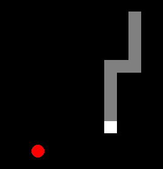

# 🐍 贪吃蛇游戏手册

 

贪吃蛇

## 🎮 游戏简介
一个经典的贪吃蛇游戏，使用 Python 的 turtle 模块开发。

## ✨ 功能特点
- 🏆 计分系统：记录当前分数和最高分
- 🍎 随机食物生成
- 🚀 可调节游戏速度
- 💀 碰撞检测：墙壁和自身

## 🕹️ 操作说明
- **W/↑**：向上移动
- **S/↓**：向下移动
- **A/←**：向左移动
- **D/→**：向右移动

## 🛠️ 技术细节
- 使用Python 3.x
- 依赖turtle模块
- 开源协议：GPL v3

## 📜 版权信息
© 2025 Karlbaey | 版本: 1.0.0